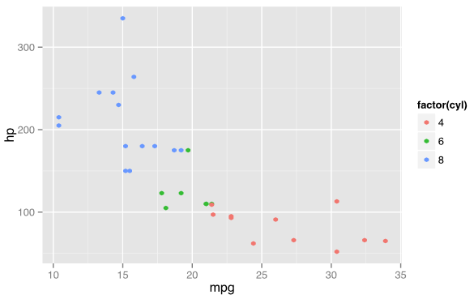

# gg4clj

gg4clj is a lightweight wrapper to make it easy to use R's ggplot2 library from Clojure. It provides a straightforward
way to express R code in Clojure, including easy mapping between Clojure data and R's data.frame, and some plumbing to
send this code to R and recover the rendered graphics. It also provides a Gorilla REPL renderer plugin to allow rendered
plots to be displayed inline in Gorilla worksheets. It is not a Clojure rewrite of ggplot2 - it calls R, which must be
installed on your system (see below), to render the plots. You'll need to be familiar with R and ggplot2, or else the
commands will seem fairly cryptic.

An example using one of R's built-in datasets:

```clojure
(gg4clj/view [:qplot :mpg :hp {:data :mtcars :color [:factor :cyl]}])
```



```clojure
(defn b-m
  []
  (let [a (rand)
        b (rand)
        r (Math/sqrt (* -2 (Math/log a)))
        th (* 2 Math/PI b)]
    (* r (Math/cos th))))

(def g-dat {:g1 (repeatedly 50 b-m) :g2 (repeatedly 50 b-m)})

(gg4clj/view [[:<- :g (gg4clj/data-frame g-dat)]
              (gg4clj/r+
                [:ggplot :g [:aes :g1 :g2]]
                [:xlim -2 2]
                [:ylim -2 2]
                [:geom_point {:colour "steelblue" :size 4}]
                [:stat_density2d {:colour "#FF29D2"}]
                [:theme_bw])]
             {:width 5 :height 5})
```


See more examples in the `ws/demo.clj` worksheet, which you can view here:

http://viewer.gorilla-repl.org/view.html?source=github&user=JonyEpsilon&repo=gg4clj&path=ws/demo.clj

## Setup

To use gg4clj in your project add it as a dependency to your `project.clj` file:

```clojure
[gg4clj "0.1.0"]
```

You will need to have R installed, and on your path so it's accessible from the command line. If you can run `Rscript`
from the command line, then you should be good to go. You will also need to make sure the ggplot2 library is installed
in R, which you can do by running the following in R (you only need to do this once):

```R
install.packages("ggplot2")
```

## Usage


## License

gg4clj is licensed to you under the MIT licence. See LICENCE.txt for details.

Copyright © 2014- Jony Hudson